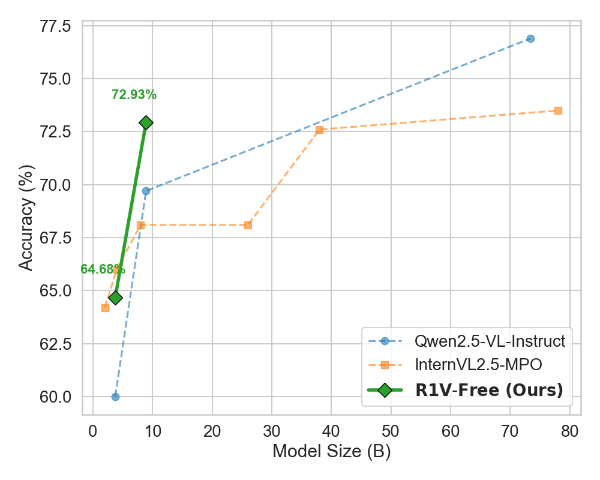
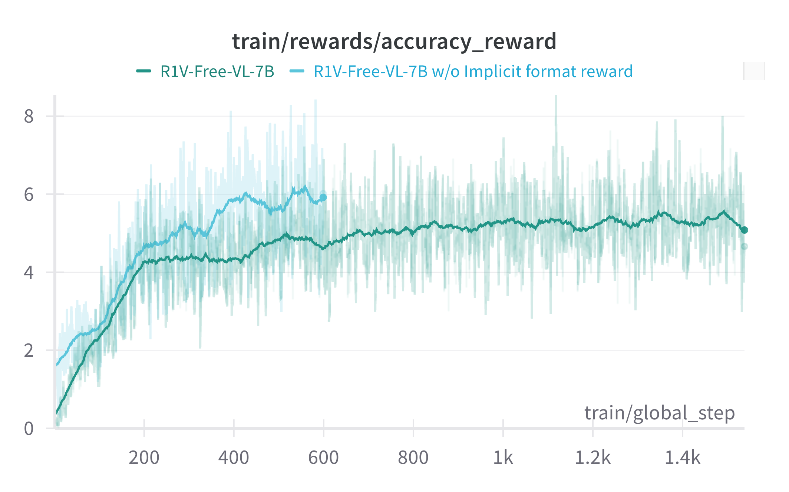
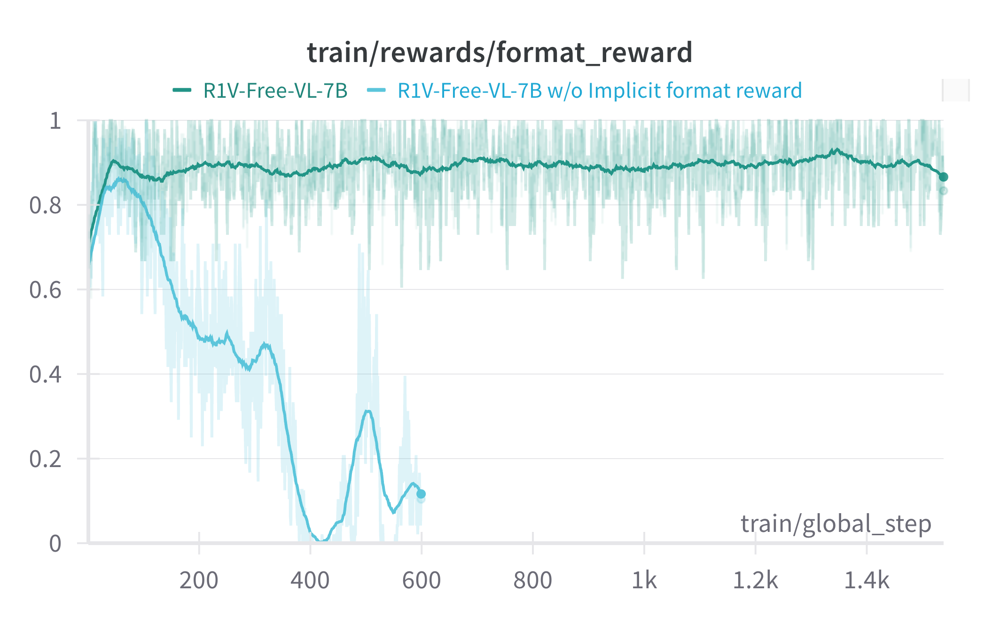
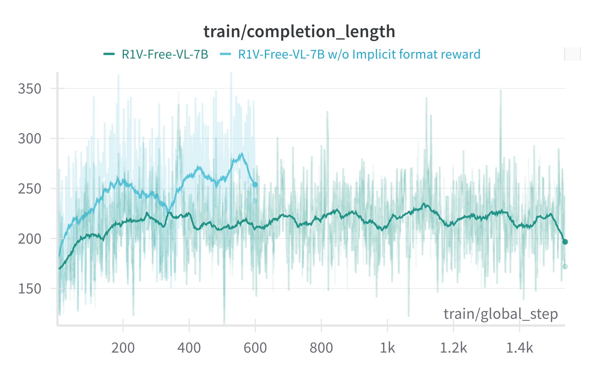
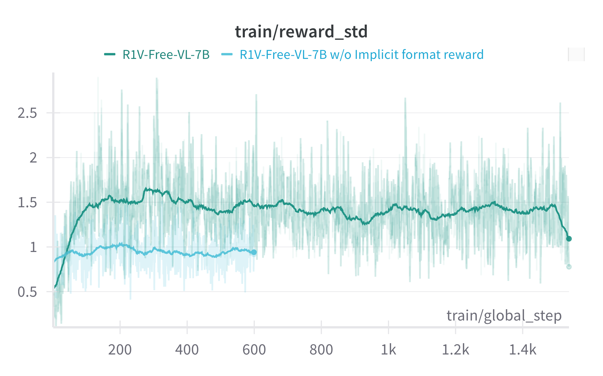

# R1V-Free: Open-World Visual Reasoning with Label-Free AI Feedback

[](https://opensource.org/licenses/MIT)

[//]: # ([![Hugging Face Datasets]&#40;https://img.shields.io/badge/%F0%9F%A4%97-Datasets-yellow&#41;]&#40;https://huggingface.co/Exgc/R1V-Free_RLHFV&#41;)

---

### 🔥Latest Updates
- **2024-04-01**: Initial release of R1V-Free framework (v0.1-alpha)


### 🚀 Key Features

- **Label-Free** 🔄: No need for ground truth labels as supervision.

- **Open-ended** 🌍: Capable of training on open-ended questions, enhancing the ability to understand open-world visual concepts.


### 📌 Todo

- [x] Release the Training Code.
- [ ] Release the Evaluation Code. 
- [x] Release the R1V-Free-3B Checkpoint.
- [x] Release the R1V-Free-7B Checkpoint.
- [ ] Release the Wandb records of the training process.

---


## 📊 Benchmark Performance

### MMVet Evaluation




## 📊 W&B Charts

| acc_reward | format_reward |
|--------|--------|
|  |  |

| completion length | reward_std |
|--------|--------|
|  |  |


---

## 🚂 Training Details

```bash

# Create and activate conda environment
conda create -n r1v-free python=3.11 -y && conda activate r1v-free

# Install dependencies with automatic CUDA detection
bash setup.sh  
```

> [!NOTE] 
> If you meet bug when running the script, first try align your environments with `./src/requirements.txt`

### Supported Models

**1. Qwen2-VL 系列**  
[[`2B-Instruct`🤗]](https://huggingface.co/Qwen/Qwen2-VL-2B-Instruct) | [[`7B-Instruct`🤗]](https://huggingface.co/Qwen/Qwen2-VL-7B-Instruct)

**2. Qwen2.5-VL 系列**  
[[`3B-Instruct`🤗]](https://huggingface.co/Qwen/Qwen2.5-VL-3B-Instruct) | [[`7B-Instruct`🤗]](https://huggingface.co/Qwen/Qwen2.5-VL-7B-Instruct)

### Supported Training Datasets
[🤗 R1V-Free Training Dataset: RLHF-V](https://huggingface.co/datasets/Exgc/R1V-Free_RLHFV)


### GRPO

```bash
cd src/R1V-Free

export DEBUG_MODE="true" # Enable Debug if you want to see the rollout of model during RL
export LOG_PATH="./debug_log.txt"
export CUDA_VISIBLE_DEVICES=0,1,2,3,4,5,6,7
export REWARD_GPUS=<GPU_NUMS of REWARD_MODEL>

torchrun --nproc_per_node="6" \
    --nnodes="1" \
    --node_rank="0" \
    --master_addr="127.0.0.1" \
    --master_port="12345" \
    src/grpo.py \
    --output_dir <OUTPUT_DIR> \
    --model_name_or_path <PATH-TO-Qwen2-VL-2B-Instruct> \
    --dataset_name Exgc/R1V-Free_RLHFV \
    --deepspeed local_scripts/zero3.json \
    --max_prompt_length 512 \
    --max_completion_length 512 \
    --per_device_train_batch_size 1 \
    --gradient_accumulation_steps 2 \
    --logging_steps 1 \
    --bf16 \
    --report_to wandb \
    --gradient_checkpointing false \
    --attn_implementation flash_attention_2 \
    --max_pixels 401408 \
    --num_train_epochs 10 \
    --run_name Qwen2-VL-2B-GRPO-RLHF-V \
    --save_steps 100 \
    --save_only_model true \
    --num_generations 8   # number of outputs G in grpo, reduce it would lead to faster training and smaller memory cost but higher variance  
```

## 🛠️  Evaluation Details

### Pretrained Models
[`【R1V-Free-2.5VL-3B】🤗`](https://huggingface.co/Exgc/R1V-Free-2.5VL-3B)

[`【R1V-Free-2.5VL-7B】🤗`](https://huggingface.co/Exgc/R1V-Free-2.5VL-7B)

### Evaluation Instructions

We evaluate our pretrained models using **[VLMEvalKit](https://github.com/open-compass/VLMEvalKit)**.

1. **Install VLMEvalKit**
   Navigate to the `src/VLMEvalKit` directory and run:

   ```bash
   pip install -e .
   ```
2. **Set up the API key (if required)**
   To use LLM APIs as the judge or choice extractor, you need to setup API keys in `src/VLMEvalKit/.env`.
3. **Run  Evaluation**
   For instance, to evaluate our R1V-Free-2.5VL-3B on MMVet dataset, navigate to `src/VLMEvalKit` and run
   ```bash
   python run.py --data MMVet --model R1V-Free-2.5VL-3B --verbose --reuse
   ```
   - `--verbose`: Shows detailed evaluation logs.
   - `--reuse`: Enables reuse of previously computed results if available.

> [!NOTE]
>  For other benchmarks supported by VLMEvalKit, you can replace `--data MMVet` with datasets like `HallusionBench`, `MathVista`,  etc.


---

## 🌐 Acknowledgements

We build upon these foundational works:

| Category             | Resources                                                                                                                                                              |
|----------------------|------------------------------------------------------------------------------------------------------------------------------------------------------------------------|
| **Codebase**         | [DeepSeek-R1](https://github.com/deepseek-ai), [Open-R1-Multimodal](https://github.com/EvolvingLMMs-Lab), [R1-V](https://github.com/Deep-Agent/R1-V), [VLMEvalKit]()   |
| **Pretrained Model** | [QwenVL](https://github.com/QwenLM/Qwen2.5-VL),[InternLM-XComposer-2.5-Reward](https://github.com/InternLM/InternLM-XComposer/tree/main/InternLM-XComposer-2.5-Reward) |
| **Training Data**    | [RLHF-V](https://arxiv.org/abs/2312.00849)                                                                                                                             |
| **Evaluation Data**  | [MMVet]()                                                                                                                                                              |    


## 📚 Citation

```bibtex
@article{Cheng_R1V-Free_Advancing_Open-World_2025,
author = {Cheng, Xize and Cai, Zhengzhou and Wang, Zehan and Ji, Shengpeng and Jiang, Ziyue and Jin, Tao and Zhao, Zhou},
title = {{R1V-Free: Advancing Open-World Visual Reasoning with Label-Free AI Feedback}},
url = {https://github.com/Exgc/R1V-Free},
year = {2025}
}
```
---
